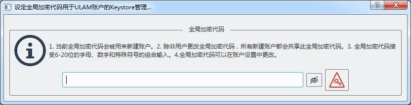
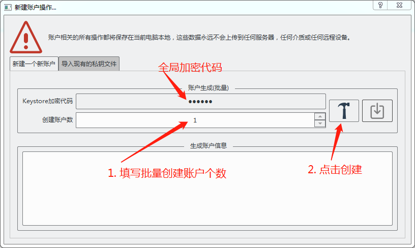
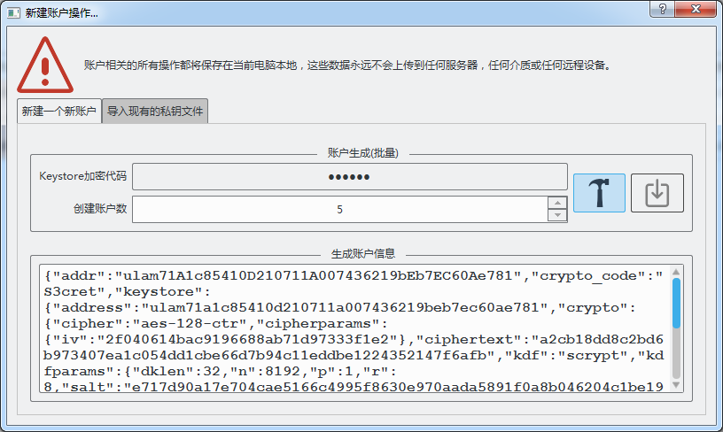
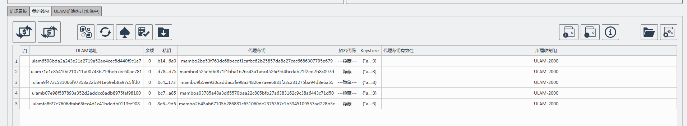

# ulaminer使用文档

## 快速上手

1. 首次使用打开ulaminer，会弹出如下对话框：

   

   此代码就是在ulamchain.io上创建账户是输入的密码。必须填写。

   ``` python
   >> 此对话框提示用户输入全局加密代码，此代码就是在ulamchain.io上创建账户是输入的密码，此密码会在批量创建账户时统一使用。如果用户拒绝填写此代码，对话框会一直弹出，且用户会被拒绝在ulaminer中新建账户。填写全局加密代码后，
   ```

2. 如果您还没有任何ULAM账户，需要在Ulaminer上创建账户，点击`我的钱包` 点击新建账户按钮

   

   弹出对话框中，Keystore加密代码就是刚才用户输入的代码，输入要创建账户的数量后，点击锤子标志创建。

   

   点击创建后，对话框可以关闭，新建的账户的代理私钥自动生成，例如此时输入批量创建5个账户。点击创建。程序反应如下：

   

   代理私钥自动生成，如下图所示。

   

   此时账户中没有ULAM余额，需要外部通过其他途径充值ULAM账户。

3. 如果你已经有了ULAM账户，需要将账户导入Ulaminer时

### 矿机使用

在不使用钱包功能的时候，矿机依然可以使用。但是使用钱包时，可以通过

1. 

### 钱包使用

#### 账户

#### 转账

#### 收割引擎相关

#### 私有数据相关

## 常见问题

### 我的私人数据是否安全？

### 

