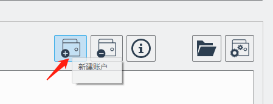

# ulaminer使用文档

## 快速上手

###首次打开

首次使用打开ulaminer，会弹出如下对话框：


此代码就是在ulamchain.io上创建账户是输入的密码。必须填写。

``` python
>> 此对话框提示用户输入全局加密代码，此代码就是在ulamchain.io上创建账户是输入的密码，此密码会在批量创建账户时统一使用。如果用户拒绝填写此代码，对话框会一直弹出，且用户会被拒绝在ulaminer中新建账户。
```

#### 使用文件导入账户

适用于你已经有了ULAM账户，需要将账户导入Ulaminer时。点击创建账户按钮：



通过文件形式导入账户数据。文件导入可以下载样例文件。文件格式为微软的2010+的电子表格文件，扩展名为xlsx，Mac版本下使用Number另存文件为此格式也可以完成导入。


导入文件样例如下，`请务必提供代理私钥`，会大大简化后续操作。


上传后，确认上传数据是否正确，如果检查无误，点击确认。上传的私钥数据，请用户务必做好数据备份。


账户导入后呈现在我的钱包主界面中。此时需要点击黑桃按钮（Spade），将当前添加的所有代理私钥都提交到矿机中开始挖矿。如果ULAM账户中有余额，挖矿工作自动开始。


#### 账户自动切分与收割功能

新导入的账户默认是ULAM-2000分组，此时只需点击收割按钮。


选择收割策略。


点击确定后开始收割。

### 矿机使用

矿机使用时有两个概念：矿工组和挖矿节点(一个账户地址，亦即一个代理私钥被称为一个节点)。矿工组是为了用户管理方便，将大量的mambo分类并实施查看挖矿状态。

#### 新建矿工组


点击矿场看板，将矿工组切换至刚刚创建的矿工组下，此时点击添加代理私钥按钮。

弹窗提示代理私钥输入，此时代理私钥数据粘贴到框内，代理私钥的格式没有任何要求


ulaminer识别出粘贴文本中的代理私钥，用户确认后添加到矿机开始挖矿。


点击添加后，矿机后台重启，开始挖矿。经过优化后的矿机，单一矿工组内可以添加少量大大增加，不在卡顿。容纳上线有待于大家的使用反馈。


### 钱包使用

#### 钱包工具栏

钱包工具栏有丰富功能，如图所示：


#### 转账

转账功能的源账户一定是本地的私有账户，如果没有在本地私有账户列表内，请添加后再转账。


#### 账户切分与合并


#### 账户

##### 批量创建账户

适用于您还没有任何ULAM账户，需要在Ulaminer上创建账户，点击`我的钱包` 点击新建账户按钮


弹出对话框中，Keystore加密代码就是刚才用户输入的代码，输入要创建账户的数量后，点击锤子标志创建。


点击创建后，对话框可以关闭，新建的账户的代理私钥自动生成，例如此时输入批量创建5个账户。点击创建。程序反应如下：


代理私钥自动生成，如下图所示。


此时账户中没有ULAM余额，需要外部通过其他途径充值ULAM账户。

##### 手动导入账户

通过粘贴输入框导入，格式如下，导入用户尽量提供代理私钥，否则会为后面操作带来困难。


点击确定后，弹出对话框，检查是否符合导入预期。


如果符合预期则点击确定，如果有错误则修改重试。

#### 收割引擎相关


#### 私有数据相关


## 常见问题（FAQ）

### Q:我的私人数据是否安全？

A: 所有的用户数据都存储在本地，用户可以随时拿到并下载另存到其他地方。

### Q:如何收费？

A：测试预览版没有任何收费计划。正式版本收费计划有待确定。


### 

